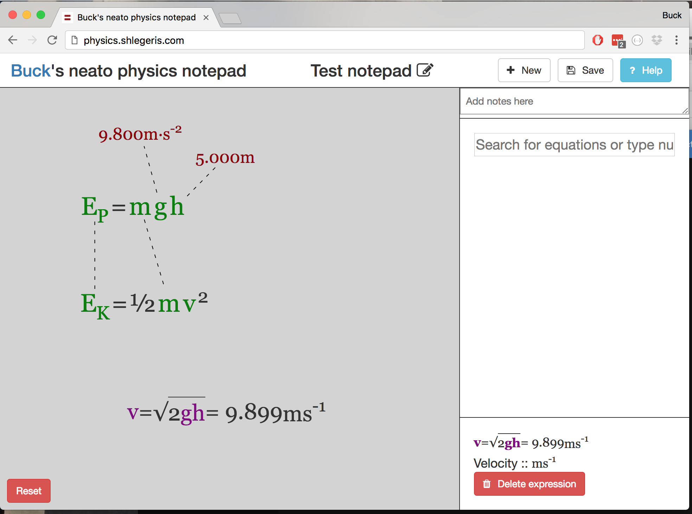

# User guide

Here's what it looks like when you use this software to solve the following problem:

> A brick slides down a slope, ending up 5 meters lower than its starting point. Neglecting friction, how fast is it going when it gets to the bottom?

This problem was solved by pulling in the definition of kinetic and potential energy, declaring the masses and energies equal between the two equations, solving for velocity, and then substituting in numerical values.

Terms used here:

- **Equation**: a declaration of facts. These have their variables in green. These might be built in equations, like the definition of kinetic energy, or they might be custom equations that you typed in yourself.
    - Equations can have their variables connected by those dotted lines. That means that those variables are equal to each other and can be interchanged during algebraic manipulation.
- **Expression**: an inference obtained by algebra on the equations. In this example there is an expression for v. Expressions are in purple.
- **Number**: a physical value. These have specified dimensions.
- **Workspace**: The light-grey area on which all your equations, expressions, and numbers live.
- **Search bar**: The box on the right that says "Search for equations or type numbers here".
- **Info box**: The box on the bottom right that displays information about whatever item in the workspace you've been interacting with.

Things you can do:

## Using built-in equations

Type relevant search terms into the search bar, click or press enter.

## Making custom equations

Type the equation you want into the search bar. Exponentiation is expressed with "**" or "^". Here are some example validly written equations:

- `E_K = 1/2 * m * v**2`
- `foo = sqrt(bar)`
- `foo = 1.2 * m + f`

## Adding numerical values

Type the number, with its dimensions if necessary, into the search bar. All of the following are valid syntax:

- 8 m/s
- 8.5 meters
- 5e12 s^-1
- 4km
- 5 lightyears
- 6Hz

All SI prefixes work.

## Moving things around

Move equations and expressions around by dragging on the bits that aren't variables--for example, operators and equals signs.

Move numbers around by dragging them.

## Declare equality between two variables

Drag between the variables. This only works if the two variables have equal dimension.

## Rewriting expressions

In the above example, when you solve for velocity, you get `v = √(2 E_K/m)`. You want to rewrite this in terms of the variables you know, which are the initial height and strength of gravity.

To do this, drag from the `E_K` in the expression to the potential energy equation `E_P = m g h`.

If you're interested in exactly how this works, this is the precise semantics:

- Let's call our expression `expr`, the variable that you want to get rid of (in this case, `E_K`) the `draggedFromVar`, and the equation dragged to the `draggedToEquation`.
- So we have:
    - `expr` = `√(2 E_K/m)`
    - `draggedFromVar` = `E_K`
    - `draggedToEquation` = `E_P = m g h`
- First, go to draggedToEquation and replace every variable that's equivalent to `draggedFromVar` with `draggedFromVar`. The result of this is `E_K = m g h`.
- Solve your new equation for `draggedFromVar`. In this case, that is trivial: the expression for `E_K` is `m g h`. Call this `draggedFromVarExpr`
- Replace `draggedFromVar` with `draggedFromVarExpr` in `expr`. Call this `replacedExpr`. In this case `replacedExpr` = `√(2 m g h/m)`.
- Simplify `replacedExpr`. The two `m`s cancel out, and we get the answer `√(2 g h)`. This is the new expression for `v`.

## Setting a variable equal to a number

First, create the number as described above. Then drag from the variable in its equation to the number.
